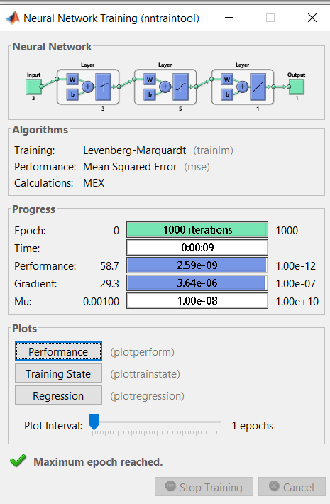

# ANNs in MATLAB
### Implementation of Artificial Neural Networks in MATLAB 
Artificial intelligence algorithms have long been used for modeling decision-making systems as they provide automated knowledge extraction and high inference accuracy. Artificial neural networks (ANNs) are a class of artificial intelligence algorithms motivated to address the different aspects or elements of learning, such as how to learn, how to induce, and how to deduce. For such problems, ANNs can help draw conclusions from case observations and address the issues of prediction and interpretation.ANNs are computational systems that simulate the microstructure (neurons) of a biological nerve system.  
Inspired by biological neurons, ANNs are composed of interconnected units called artificial neuron, some of the neurons interface with the real world to receive its input (input layer), and other neurons provide the real world with the network's output (output layer), while all the rest of the neurons are hidden from view (hidden layers). As in nature, the network function is determined largely by the interconnections between neurons, which are not simple connections, but certain non-linear functions. Each input to a neuron has a weight factor of the function that determines the strength of the interconnection and thus the contribution of that interconnection to the following neurons.  
ANNs can be trained to perform a particular function by adjusting the values of these weight factors between the neurons, either by using information from outside the network or by the neurons themselves in response to the input. For materials research, a certain amount of experimental results are always needed first to develop a well-performing neural network, including its architecture, training functions, training algorithms and other parameters, followed by the training process and the evaluation method. After the network has learnt to solve problems based on these datasets, new data from the same knowledge domain can then be put into the trained neural network to output realistic solutions. 

## Algorithms 
1. Levenberg-Marquardt 
2. Bayesian Regularization 
3. BFGS Quasi-Newton 
4. Resilient Backpropagation 
5. Scaled Conjugate Gradient 
6. Conjugate Gradient with Powell/Beale Restarts 
7. Fletcher-Powell Conjugate Gradient 
8. Polak-Ribiére Conjugate Gradient 
9. One Step Secant 
10. Variable Learning Rate Gradient Descent 
11. Gradient Descent with Momentum 
12. Gradient Descent  

The fastest training function is generally trainlm, and it is the default training function for feedforwardnet. The quasi-Newton method, trainbfg, is also quite fast. Both of these methods tend to be less efficient for large networks (with thousands of weights), since they require more memory and more computation time for these cases. Also, trainlm performs better on function fitting (nonlinear regression) problems than on pattern recognition problems. 

When training large networks, and when training pattern recognition networks, trainscg and trainrp are good choices. Their memory requirements are relatively small, and yet they are much faster than standard gradient descent algorithms. 

Here, the model is trained to predict the output of an equation: **y=2a+3b+5c** by back propagation algorithm- Levenberg- Marquardt Backpropagation for various user defined values of a, b and c.

## CODE
See [Code](ann.m)

## OUTPUT

## References: 
https://www.sciencedirect.com/topics/physics-and-astronomy/artificial-neural-network, https://in.mathworks.com/help/deeplearning/ug/train-and-apply-multilayer-neural-networks.html
